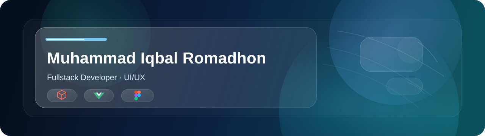

# 

<!-- <h1 align="center">Muhammad Iqbal Romadhon</h1> -->

  <!-- <strong>Iqbal</strong>  -->
  ☕ Frontend Developer | 🎨 UI/UX

  
  
  

## Tech Stack

  
  
  
  
  
  
  
  
  
  
  
  
  
  
  
  
  

## GitHub Statistics

<table>
  <tr>
    <td width="50%" align="center">
      
    </td>
    <td width="50%" align="center">
      
    </td>
  </tr>
</table>

  <picture>
    <source media="(prefers-color-scheme: dark)" srcset="https://raw.githubusercontent.com/Iqbaallx/Iqbaallx/output/galaga-contribution-graph-dark.svg" />
    <source media="(prefers-color-scheme: light)" srcset="https://raw.githubusercontent.com/Iqbaallx/Iqbaallx/output/galaga-contribution-graph.svg" />
    
  </picture>

